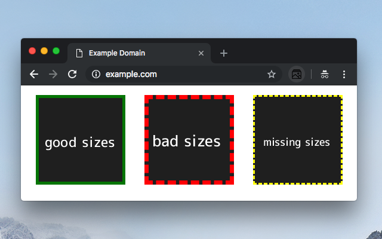
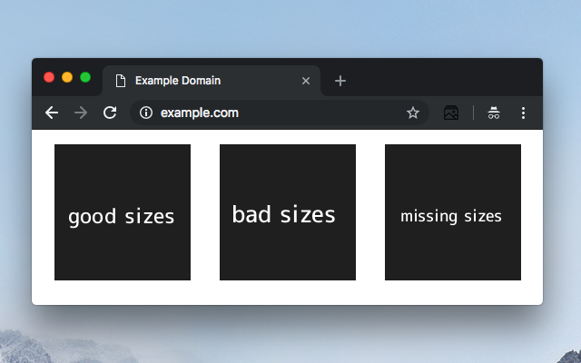

# Sizes-webextension

Web-extension to debug img `sizes` attribute.

- `small yellow dashed` border on images if the `sizes` attribute is missing.
- `green solid` if the calculated size value is equal to real width of image in current viewport size.
- `red dashed` else.

## Download/install

- [Firefox add-on](https://addons.mozilla.org/fr/firefox/addon/sizes/)
- [Chrome extension](https://chrome.google.com/webstore/detail/sizes/mbpjpbahlnlfgiibginioghooclhhlah)

## Usage

This extension add a button in your browser navigation bar.

Click on it to enable or disable the extension in current tab.

Then images are outlined. You can resize your screen or use responsive mode of your debug tools to check your sizes visually.

